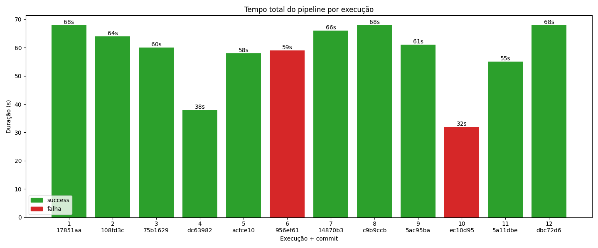
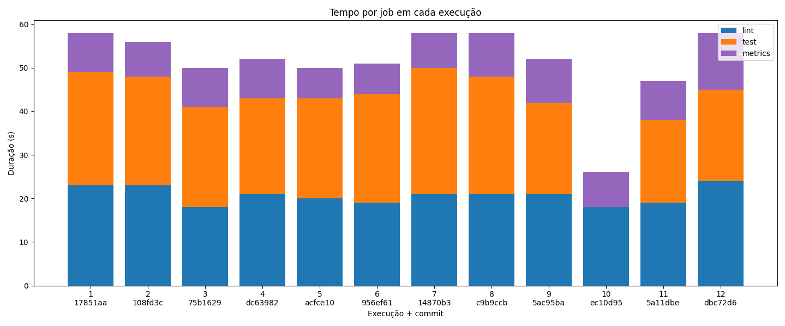
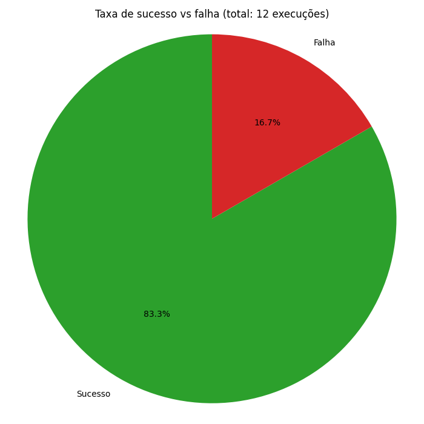
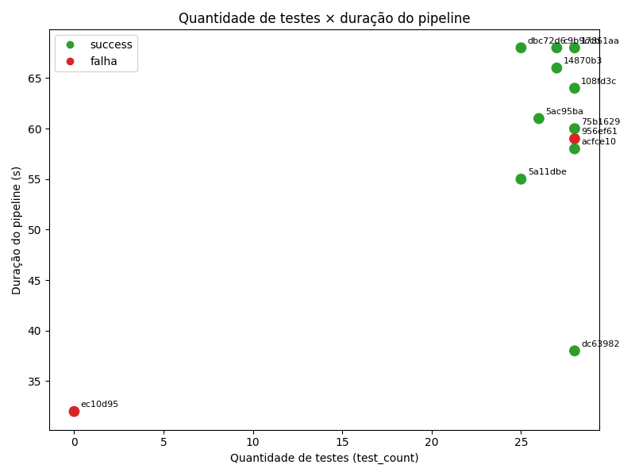

# Relatório Técnico — Experimento de Observabilidade de Pipeline CI/CD

**Autor:** gabrielsnascimento
**Repositório:** https://github.com/gabrielsnascimento/cpf-cnpj-validator
**Workflow (YAML):** https://github.com/gabrielsnascimento/cpf-cnpj-validator/blob/main/.github/workflows/ci.yml
**Período do experimento:** 04/06/2026, entre 17:07 e 18:50 (UTC)

---

## 1. Introdução

Este projeto implementa um **validador de CPF e CNPJ** em Python e o utiliza como
base para um **experimento de observabilidade de pipeline CI/CD** no GitHub
Actions. O código do validador é deliberadamente simples e estável — o foco da
atividade **não é o validador**, e sim **medir e analisar o comportamento do
pipeline** ao longo de 12 execuções reais, variando o código e a configuração de
forma controlada.

**Objetivo:** instrumentar o pipeline, coletar métricas reais via API do GitHub,
armazená-las em CSV, gerar gráficos e produzir uma análise crítica sobre
desempenho, estabilidade e gargalos.

**Tecnologias:**

- **Python 3.12** (runtime do CI) — testes com **pytest** + **pytest-json-report**, lint com **flake8**
- **GitHub Actions** — pipeline de 3 jobs
- **requests** — coleta via API REST do GitHub (`collect_metrics.py`)
- **pandas** + **matplotlib** — geração dos gráficos (`generate_graphs.py`)

---

## 2. Estrutura do pipeline

Definido em [`.github/workflows/ci.yml`](https://github.com/gabrielsnascimento/cpf-cnpj-validator/blob/main/.github/workflows/ci.yml).
Durante a maior parte do experimento os jobs rodaram em sequência:

```
lint  →  test  →  metrics
```

| Job | O que faz | Atende ao requisito |
|---|---|---|
| **lint** | Instala dependências (cache do pip por `hashFiles('requirements.txt')`) e roda `flake8 src/ tests/` | análise estática |
| **test** | Instala dependências e roda `pytest`, gerando `test-results.json`; sobe como artefato (`if: always()`) | testes + **artefato** |
| **metrics** | Roda `scripts/snapshot_metrics.py`, gera `metrics_snapshot.json` e o sobe como artefato (roda sempre, `if: always()`) | **coleta de métricas** |

A coleta consolidada das 12 runs é feita localmente por `collect_metrics.py`
(consulta a API → `metrics.csv`) e a visualização por `generate_graphs.py`
(→ 4 PNGs em `graphs/`).

---

## 3. Variações realizadas (commits reais)

As 12 execuções, em ordem cronológica, com **SHA e run ID reais**:

| # | Run ID | SHA | Mensagem do commit | Variação aplicada | Status |
|---|--------|-----|--------------------|-------------------|--------|
| 1 | 26967135421 | `dbc72d6` | feat: configuração inicial do projeto | Baseline — primeira run (cache frio) | ✅ success |
| 2 | 26967836547 | `5a11dbe` | docs: comentario no validador | Mudança neutra (cache quente) | ✅ success |
| 3 | 26969694352 | `ec10d95` | test: adiciona mais um teste de CNPJ | **Falha de lint** (W293, espaço em linha em branco) | 🔴 failure |
| 4 | 26969896780 | `5ac95ba` | fix: corrige erro de linha vazia | Correção do lint | ✅ success |
| 5 | 26970190389 | `c9b9ccb` | test: adiciona teste lento | **Teste lento** (`sleep(3)`) | ✅ success |
| 6 | 26970365493 | `14870b3` | build: adiciona dependencia (invalida cache) | **Alteração no cache** (novo pacote em `requirements.txt`) | ✅ success |
| 7 | 26970688504 | `956ef61` | test: introduz falha proposital de teste | **Falha de teste** (asserção incorreta) | 🔴 failure |
| 8 | 26970928532 | `acfce10` | fix: corrige teste que falhava | Correção do teste | ✅ success |
| 9 | 26971401966 | `dc63982` | ci: roda lint e test em paralelo | **Jobs em paralelo** (remoção do `needs`) | ✅ success |
| 10 | 26971648030 | `75b1629` | ci: volta jobs para execucao sequencial | Volta ao **sequencial** (par de comparação) | ✅ success |
| 11 | 26972043069 | `108fd3c` | docs: adiciona readme a atividade | Documentação | ✅ success |
| 12 | 26972531902 | `17851aa` | ci: reordena jobs para test -> lint -> metrics | **Alteração na ordem dos jobs** | ✅ success |

> A run #3, embora a intenção fosse aumentar a quantidade de testes, introduziu
> sem querer um espaço em branco numa linha vazia (`W293`) e falhou no lint —
> servindo, na prática, como o caso de **falha de lint**. As variações cobrem
> todos os exemplos sugeridos pela atividade: teste passando/falhando, aumento de
> testes, teste lento, cache, ordem dos jobs e sequencial × paralelo.

---

## 4. Evidências de execução

Links diretos das 12 runs reais (`https://github.com/gabrielsnascimento/cpf-cnpj-validator/actions/runs/<RUN_ID>`):

| # | Run ID | Link |
|---|--------|------|
| 1 | 26967135421 | https://github.com/gabrielsnascimento/cpf-cnpj-validator/actions/runs/26967135421 |
| 2 | 26967836547 | https://github.com/gabrielsnascimento/cpf-cnpj-validator/actions/runs/26967836547 |
| 3 | 26969694352 | https://github.com/gabrielsnascimento/cpf-cnpj-validator/actions/runs/26969694352 |
| 4 | 26969896780 | https://github.com/gabrielsnascimento/cpf-cnpj-validator/actions/runs/26969896780 |
| 5 | 26970190389 | https://github.com/gabrielsnascimento/cpf-cnpj-validator/actions/runs/26970190389 |
| 6 | 26970365493 | https://github.com/gabrielsnascimento/cpf-cnpj-validator/actions/runs/26970365493 |
| 7 | 26970688504 | https://github.com/gabrielsnascimento/cpf-cnpj-validator/actions/runs/26970688504 |
| 8 | 26970928532 | https://github.com/gabrielsnascimento/cpf-cnpj-validator/actions/runs/26970928532 |
| 9 | 26971401966 | https://github.com/gabrielsnascimento/cpf-cnpj-validator/actions/runs/26971401966 |
| 10 | 26971648030 | https://github.com/gabrielsnascimento/cpf-cnpj-validator/actions/runs/26971648030 |
| 11 | 26972043069 | https://github.com/gabrielsnascimento/cpf-cnpj-validator/actions/runs/26972043069 |
| 12 | 26972531902 | https://github.com/gabrielsnascimento/cpf-cnpj-validator/actions/runs/26972531902 |

### Base de dados coletada (`metrics.csv`)

Gerada por `collect_metrics.py` a partir da **API do GitHub** (não copiada da
interface). Dados reais (ordenados do mais recente para o mais antigo, como
retornados pela API):

| run_id | sha | status | wf (s) | lint (s) | test (s) | metrics (s) | test_count | test_failures | test_dur (s) |
|--------|-----|--------|-------:|---------:|---------:|------------:|-----------:|--------------:|-------------:|
| 26972531902 | 17851aa | success | 68 | 23 | 26 | 9 | 28 | 0 | 3.056 |
| 26972043069 | 108fd3c | success | 64 | 23 | 25 | 8 | 28 | 0 | 3.057 |
| 26971648030 | 75b1629 | success | 60 | 18 | 23 | 9 | 28 | 0 | 3.055 |
| 26971401966 | dc63982 | success | 38 | 21 | 22 | 9 | 28 | 0 | 3.051 |
| 26970928532 | acfce10 | success | 58 | 20 | 23 | 7 | 28 | 0 | 3.052 |
| 26970688504 | 956ef61 | failure | 59 | 19 | 25 | 7 | 28 | 1 | 3.073 |
| 26970365493 | 14870b3 | success | 66 | 21 | 29 | 8 | 27 | 0 | 3.039 |
| 26970190389 | c9b9ccb | success | 68 | 21 | 27 | 10 | 27 | 0 | 3.049 |
| 26969896780 | 5ac95ba | success | 61 | 21 | 21 | 10 | 26 | 0 | 0.047 |
| 26969694352 | ec10d95 | failure | 32 | 18 | 0 | 8 | 0 | 0 | 0.000 |
| 26967836547 | 5a11dbe | success | 55 | 19 | 19 | 9 | 25 | 0 | 0.046 |
| 26967135421 | dbc72d6 | success | 68 | 24 | 21 | 13 | 25 | 0 | 0.044 |

> **Estrutura do CSV** (formato *wide*): `run_id, commit_sha, commit_message,
> status, workflow_duration, job_lint_duration, job_test_duration,
> job_metrics_duration, test_count, test_failures, test_passed, test_duration_s,
> **test_avg_duration_s**, timestamp`. É equivalente (superset) ao formato
> sugerido na atividade — em vez de linhas `job_name/job_duration`, cada job vira
> uma coluna. O **tempo médio dos testes** está explícito na coluna
> `test_avg_duration_s` (= `test_duration_s / test_count`).
>
> **Tempo por etapa (`metrics_steps.csv`):** além do CSV principal, o
> `collect_metrics.py` gera um segundo arquivo em formato *long* — `run_id,
> commit_sha, job_name, step_name, step_duration_s, conclusion` — com a duração
> de **cada step** (etapa) de cada job (checkout, install, pytest, flake8, ...),
> extraída da API. São 361 linhas (steps) das 12 execuções, atendendo
> diretamente ao requisito de "tempo de cada etapa relevante".

---

## 5. Resultados e gráficos

> Observação: no eixo X dos gráficos as execuções aparecem na ordem retornada
> pela API (a posição **1 = run mais recente**, `17851aa`; posição **12 = run
> mais antiga**, `dbc72d6`). Os rótulos trazem o SHA para identificação
> inequívoca.

### 5.1 Tempo total do pipeline por execução



As barras variam entre **32s e 68s**. As duas vermelhas são as falhas: `956ef61`
(falha de teste, 59s) e `ec10d95` (falha de lint, **32s** — a mais curta de
todas, pois parou cedo). A barra verde mais baixa é `dc63982` (**38s**), a única
execução com **jobs em paralelo** — destaca-se claramente do restante (~55–68s).

### 5.2 Tempo por job em cada execução



Cada barra empilha `lint` (azul) + `test` (laranja) + `metrics` (roxo). Dois
pontos saltam aos olhos: (1) a execução `ec10d95` **não tem a camada laranja** —
o lint falhou e o `test` nunca rodou; (2) `lint` e `test` têm **pesos
semelhantes** (~18–26s cada), enquanto `metrics` é leve (~7–13s).

### 5.3 Taxa de sucesso vs falha



**83,3% de sucesso** (10 runs) e **16,7% de falha** (2 runs) — exatamente as duas
falhas intencionais/controladas do experimento.

### 5.4 Quantidade de testes × duração do pipeline



Não há correlação clara entre `test_count` e a duração. O ponto vermelho em
`test_count = 0` (`ec10d95`) é a falha de lint (nenhum teste contabilizado). Entre
as execuções com 25–28 testes, a duração varia por outros fatores (paralelismo,
cache) e não pelo número de testes — o ponto `dc63982` (paralelo) fica isolado
embaixo, em 38s, apesar de ter os mesmos 28 testes das vizinhas.

---

## 6. Análise das perguntas

### 6.1 Qual etapa mais contribuiu para o tempo total do pipeline?

A etapa dominante é a **instalação de dependências** (`pip install -r
requirements.txt`), repetida em cada job. Isso é comprovado pelos dados de
**step** coletados em `metrics_steps.csv` — média por etapa:

| Step (etapa) | Duração média |
|---|---:|
| **Install dependencies** | **13,4s** |
| Run pytest | 2,6s |
| Install requests (job metrics) | 2,5s |
| Cache pip | 1,5s |
| Set up job | 1,2s |
| **Run flake8** | **0,4s** |
| Setup Python 3.12 | 0,3s |

Ou seja: o `flake8` em si leva 0,4s e o `pytest` ~2,6s (quase todo do `sleep`
artificial), mas **instalar dependências leva 13,4s** — e como o pipeline é
sequencial e cada job provisiona um runner novo, esse custo é pago **três vezes**
por execução. A maior contribuição ao tempo total não vem de testar nem de
lintar, e sim do **overhead repetido de preparar o ambiente**.

### 6.2 Houve diferença significativa entre execuções com e sem cache?

A diferença existe, mas é **modesta**. A run `14870b3` (que alterou o
`requirements.txt` e **invalidou o cache**) teve o `job_test_duration` mais alto
do experimento (**29s**), contra ~21–23s das execuções vizinhas com cache quente
— ou seja, ~6–8s a mais na instalação. Não foi um salto dramático porque as
dependências são distribuídas como *wheels* e a rede dos runners hospedados é
rápida; o cache ajuda, mas o gargalo maior é o próprio ato de instalar/preparar o
ambiente, não o download em si.

### 6.3 O paralelismo reduziu o tempo total? Em que condições?

**Sim, de forma clara.** Com o mesmo código:

| Execução | Configuração | Tempo total |
|---|---|---|
| `dc63982` (#9) | lint e test **em paralelo** | **38s** |
| `75b1629` (#10) | lint e test **sequenciais** | **60s** |

Redução de **~37%**. A condição para o ganho é que os jobs sejam
**independentes** (não há dependência de dados entre `lint` e `test`). Ao rodarem
juntos, o tempo deixa de ser `lint + test + metrics` e passa a ser
`max(lint, test) + metrics`. O ganho é real justamente porque os dois jobs têm
durações parecidas — paralelizar duas etapas equivalentes é o cenário ideal.

### 6.4 Quais falhas foram mais frequentes?

Foram **2 falhas em 12 execuções (16,7%)**, distribuídas por tipo:

| Tipo de falha | Ocorrências | Exemplo | Comportamento |
|---|---|---|---|
| Lint (estilo) | 1 | `ec10d95` (W293) | Para no job `lint`; `test` nem roda → falha **rápida** (32s) |
| Teste (lógica) | 1 | `956ef61` (asserção) | `lint` passa, `test` roda inteiro → falha **mais lenta** (59s) |

Em frequência ficaram empatadas (1 e 1). O dado mais interessante é o
**comportamento**: a falha de lint dá feedback quase 2× mais rápido que a de
teste, porque interrompe o pipeline antes.

### 6.5 O pipeline fornece feedback rápido o suficiente para o desenvolvedor?

Razoável, com ressalvas. Os tempos totais ficaram entre **32s e 68s** — abaixo do
limiar de ~1–2 min costuma ser considerado bom para feedback de CI. Porém, para
um projeto **tão pequeno**, gastar ~1 minuto é desproporcional: o tempo é quase
todo *overhead* de infraestrutura (instalar dependências 3×), não trabalho útil.
O paralelismo já derrubou para 38s, e há margem clara para melhorar (ver 6.6). Em
resumo: é aceitável, mas longe do ótimo possível.

### 6.6 Que melhorias poderiam ser feitas no pipeline?

1. **Paralelizar `lint` e `test`** definitivamente — comprovadamente ~37% mais rápido.
2. **Enxugar as dependências de CI.** O `requirements.txt` inclui `pandas` e
   `matplotlib`, que só são usados para gerar gráficos **localmente** — mas o CI
   os instala em `lint` e `test`. Separar `requirements-dev.txt` (CI) de
   `requirements-graphs.txt` (local) cortaria boa parte do tempo de instalação,
   que é o gargalo (ver 6.1).
3. **Unificar `lint` e `test` num job só** (ou usar cache compartilhado entre
   jobs) para pagar o setup de ambiente uma vez em vez de três.
4. **Usar o cache nativo do `actions/setup-python`** (`cache: pip`) em vez do
   `actions/cache` manual.

### 6.7 Quais limitações existem nos dados coletados?

- **Amostra pequena (12 runs):** insuficiente para conclusões estatísticas; outliers pesam muito.
- **Runners compartilhados:** as VMs do GitHub são compartilhadas → variação de tempo entre runs idênticas (ruído de medição).
- **Granularidade de job, não de etapa:** medimos a duração de cada *job*, não de cada *step* isolado; o tempo de "instalar dependências" vs "rodar a ferramenta" foi inferido, não medido diretamente.
- **`workflow_duration` inclui overhead** (fila, provisionamento), não só execução útil.
- **Testes rápidos demais:** com o pytest rodando em milissegundos (fora o `sleep`), o `test_count` não tem efeito mensurável sobre a duração — limita a análise da pergunta 5.4.
- **Dependência de rede** para o `pip install`: lentidões pontuais do PyPI contaminam a medição.

### 6.8 Como essa análise poderia apoiar decisões de engenharia?

- **Justificar mudanças com dados:** a decisão de paralelizar deixa de ser "achismo" — há evidência de ganho de 37%.
- **Priorizar o gargalo certo:** os dados mostram que otimizar a *instalação de dependências* rende muito mais que otimizar testes/lint. Direciona o esforço de engenharia para onde importa.
- **Definir SLAs de feedback realistas** (ex.: "todo PR recebe resultado de CI em < 45s") com base em medições, não em palpite.
- **Escolher a estratégia de falha:** saber que lint falha em 32s e teste em 59s ajuda a decidir a ordem dos jobs (fail-fast).
- **Monitorar tendência ao longo do tempo:** o mesmo `collect_metrics.py` pode rodar periodicamente para detectar regressões de performance do pipeline antes que virem dor.

---

## 7. Resultados inesperados

### 7.1 O gargalo não são os testes — é a instalação de dependências

- **Hipótese inicial:** o job `test` (rodar o pytest) seria o maior responsável pelo tempo, e aumentar o número de testes encareceria o pipeline.
- **Resultado observado:** os dados de step mostram `Run pytest` em ~2,6s e `Run flake8` em **0,4s**, contra **13,4s** do `Install dependencies` — irrelevantes perto do *setup + install* de cada job. Mesmo o teste lento (`sleep(3)`, run `c9b9ccb`) mal mexeu no tempo total (68s, dentro da faixa normal). O `test_count` não tem correlação visível com a duração (gráfico 5.4).
- **Explicação:** o custo real do CI é **preparar o ambiente** (checkout, setup-python, `pip install`), pago a cada job — e não o trabalho de testar/lintar em si.

### 7.2 O job de lint é quase tão "caro" quanto o de teste

- **Hipótese inicial:** o `lint` seria o job mais leve e rápido, já que o `flake8` é uma checagem estática trivial.
- **Resultado observado:** `lint` levou ~18–24s, **praticamente igual** ao `test` (~19–29s), apesar de o step `Run flake8` em si gastar apenas **0,4s**.
- **Explicação:** os steps revelam que o job `lint` gasta ~15s só no `Install dependencies` — ele faz checkout + setup-python + **instala o `requirements.txt` inteiro** (incluindo `pandas` e `matplotlib`, que ele nem usa). Quase todo o tempo do `lint` é overhead de instalação — o que reforça diretamente a melhoria #2 da seção 6.6.

---

## 8. Limitações do experimento

1. **Ambiente compartilhado do GitHub Actions** — runners hospedados são VMs não dedicadas; contenção de CPU/IO/rede introduz variância fora do nosso controle.
2. **Variação de tempo entre runs equivalentes** — execuções com código idêntico oscilam (ex.: runs verdes entre 55s e 68s), dificultando atribuir pequenas diferenças a uma variação específica.
3. **Amostra pequena (12 execuções)** — insuficiente para significância estatística; um único outlier distorce médias.
4. **Dependência de rede para instalar pacotes** — o tempo do `pip install`, que é o gargalo, depende da disponibilidade do PyPI e do estado do cache.
5. **Suíte de testes muito rápida** — exceto pelo `sleep` artificial, os testes rodam em milissegundos, ofuscando o efeito do `test_count`.
6. **Resolução temporal de 1 segundo** — a API do GitHub reporta os timestamps de steps com precisão de segundos, então etapas muito curtas (`flake8`, `setup-python`) aparecem arredondadas (0–1s), limitando a precisão da medição das etapas mais rápidas.

---

## 9. Como reproduzir

1. **Clonar e preparar o ambiente:**
   ```bash
   git clone https://github.com/gabrielsnascimento/cpf-cnpj-validator.git
   cd cpf-cnpj-validator
   python3 -m venv .venv && source .venv/bin/activate
   pip install -r requirements.txt
   ```
   > Use Python 3.11–3.13 (o CI usa 3.12) para as wheels do `matplotlib` instalarem sem compilar.

2. **Rodar testes e lint localmente:**
   ```bash
   flake8 src/ tests/
   pytest
   ```

3. **Executar o pipeline:** fazer pushes com variações (cada push dispara uma run no GitHub Actions).

4. **Coletar as métricas reais:**
   ```bash
   export GITHUB_TOKEN=$(gh auth token)
   python collect_metrics.py --repo gabrielsnascimento/cpf-cnpj-validator --max-runs 12
   ```
   → gera o `metrics.csv` (resumo por run) e o `metrics_steps.csv` (tempo por
   etapa). O `--max-runs 12` restringe às 12 execuções do experimento
   controlado, ignorando commits de documentação feitos depois.

5. **Gerar os gráficos:**
   ```bash
   python generate_graphs.py --input metrics.csv
   ```
   → cria os 4 PNGs em `graphs/`.

6. **Empacotar os entregáveis:**
   ```bash
   python scripts/build_entregaveis.py
   ```
   → organiza `metrics.csv`, gráficos e este relatório em `entregaveis/`.
